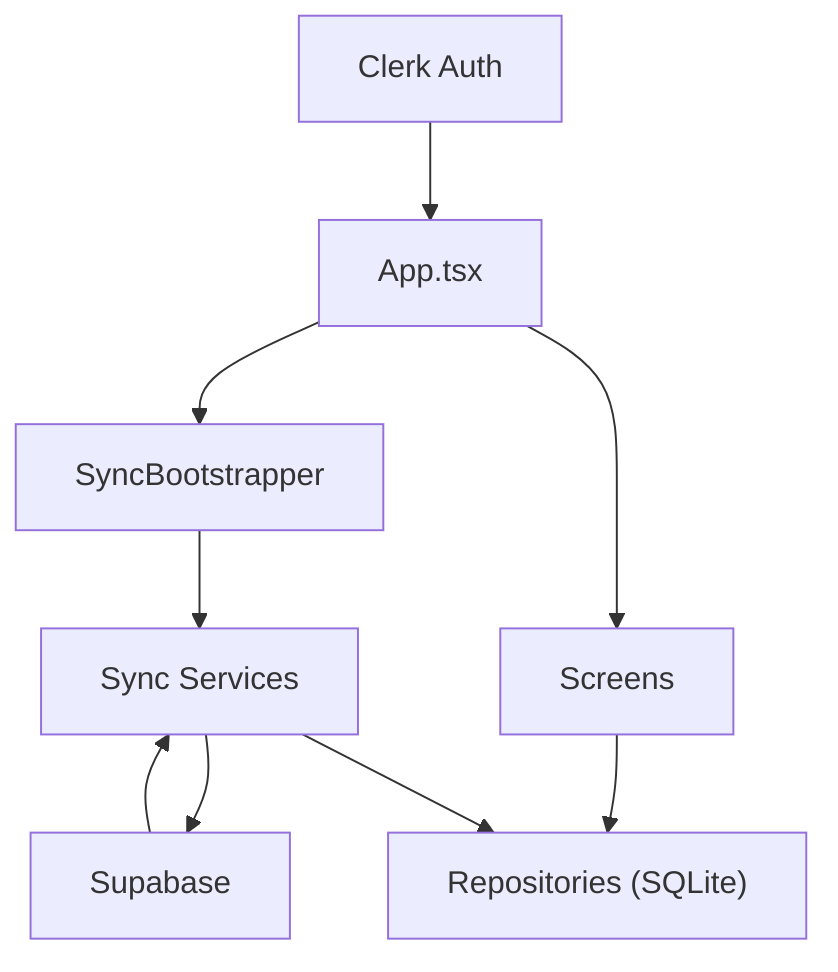

# AIRagMessenger

AIRagMessenger is an Expo React Native chat application built around an
offline-first data model. The app stores conversations and messages in local
SQLite immediately, then synchronizes them with Supabase when the signed-in
Clerk user has a valid token and network is available.

## What It Does

- Authenticates users with Clerk
- Stores chats, contacts, and sync state locally with Expo SQLite
- Creates conversations from contacts discovered by email
- Shows a chat list with search, profile summary, and add-contact flow
- Opens a chat thread with timestamps, pull-to-refresh, retryable sync, and
  realtime updates
- Pushes local conversations and messages to Supabase
- Pulls remote conversations and messages back into SQLite

## Tech Stack

- Expo SDK 54
- React Native 0.81
- React 19.1 / React DOM 19.1
- TypeScript
- React Navigation
- NativeWind
- Clerk Expo
- Supabase JS
- Expo SQLite

## System Architecture



Core idea:

- SQLite is the source of truth for the running app
- repositories isolate all local SQL access
- services handle network sync, remote pulls, realtime, and user lookup
- Clerk provides the current user identity and Supabase JWT template
- Supabase acts as the remote persistence and collaboration layer

## End-to-End Workflow

### 1. App Startup

1. `App.tsx` loads env config and Clerk provider.
2. `initializeDatabase()` opens SQLite and runs migrations.
3. `debugDatabaseHealthCheck()` runs local startup verification.
4. If the Clerk user is signed in, the app stack is shown.
5. `SyncBootstrapper` starts background sync tasks.

### 2. Authentication

1. Clerk controls signed-in state through `useAuth()`.
2. Signed-out users see `LoginScreen` and `SignupScreen`.
3. Signed-in users enter the app stack with Chat List, Chat, and Add Contact.

### 3. Add Contact -> Create Conversation

1. `AddContactScreen` accepts a name and email.
2. The app validates the email and prevents adding your own account.
3. `userDirectory` looks up whether that email belongs to an app user.
4. `contactsRepository` saves the contact locally.
5. `conversationRepository` creates a local conversation with owner/contact
   metadata and a `participant_key`.
6. `conversationSync` pushes that local conversation to Supabase.

### 4. Send Message

1. `ChatScreen` saves the message locally first through `messageRepository`.
2. The message appears immediately from SQLite.
3. `messageSync` checks whether the conversation already has a remote
   Supabase id.
4. If needed, it syncs pending conversations first.
5. The message is then upserted to Supabase.
6. Local sync fields are updated:
   `synced`, `remoteId`, `syncError`.

### 5. Receive Remote Updates

1. `SyncBootstrapper` pulls remote conversations after sign-in.
2. `ChatListScreen` refreshes local conversations when focused.
3. `ChatScreen` pulls remote messages for the open thread.
4. `messageRealtime` subscribes to Supabase changes for the active
   conversation.
5. Pulled and realtime messages are written back into SQLite so the UI still
   reads from one local source.

## Folder Guide

- `src/components`
  UI building blocks and background app helpers such as conversation rows,
  profile summary, and sync bootstrapping.
- `src/config`
  Environment parsing and runtime-safe config access.
- `src/db`
  SQLite database setup, migrations, debug checks, seed data, and repositories.
- `src/navigation`
  Navigation route types for the signed-in app stack.
- `src/screens`
  User-facing screens: auth, chat list, chat thread, contact creation, and the
  older home screen scaffold.
- `src/services`
  Network-facing and orchestration logic: Supabase client creation, sync,
  pulls, realtime subscriptions, and remote user lookup.
- `src/types`
  Shared data models for conversations, messages, and contacts.
- `src/utils`
  Small cross-cutting helpers such as date formatting and participant key
  generation.
- `src/ai`
  Reserved for future AI-related features.
- `src/store`
  Reserved for future client-side state modules.

## File Guide

- [App.tsx](/abs/path/C:/Users/91974/Desktop/AIRagMessenger/App.tsx)
  App root. Wires Clerk, initializes SQLite, mounts navigation, and starts the
  sync bootstrapper.
- [src/components/ConversationItem.tsx](/abs/path/C:/Users/91974/Desktop/AIRagMessenger/src/components/ConversationItem.tsx)
  Chat list row UI with avatar, title, preview, time, and unread placeholder.
- [src/components/ProfileSummary.tsx](/abs/path/C:/Users/91974/Desktop/AIRagMessenger/src/components/ProfileSummary.tsx)
  Displays current user profile context near the chat list.
- [src/components/SyncBootstrapper.tsx](/abs/path/C:/Users/91974/Desktop/AIRagMessenger/src/components/SyncBootstrapper.tsx)
  Runs initial remote registration, conversation sync, remote pull, and pending
  message sync after sign-in.
- [src/config/env.ts](/abs/path/C:/Users/91974/Desktop/AIRagMessenger/src/config/env.ts)
  Reads `EXPO_PUBLIC_*` env vars and exposes normalized runtime config.
- [src/db/database.ts](/abs/path/C:/Users/91974/Desktop/AIRagMessenger/src/db/database.ts)
  Opens the SQLite database and ensures migrations run once.
- [src/db/migrations.ts](/abs/path/C:/Users/91974/Desktop/AIRagMessenger/src/db/migrations.ts)
  Creates and upgrades SQLite tables and columns.
- [src/db/conversationRepository.ts](/abs/path/C:/Users/91974/Desktop/AIRagMessenger/src/db/conversationRepository.ts)
  Local CRUD and query logic for conversations, including sync metadata.
- [src/db/messageRepository.ts](/abs/path/C:/Users/91974/Desktop/AIRagMessenger/src/db/messageRepository.ts)
  Local CRUD and query logic for messages, including sync status and remote ids.
- [src/db/contactsRepository.ts](/abs/path/C:/Users/91974/Desktop/AIRagMessenger/src/db/contactsRepository.ts)
  Local contact storage and validation helpers.
- [src/db/seed.ts](/abs/path/C:/Users/91974/Desktop/AIRagMessenger/src/db/seed.ts)
  Dummy local data seeding for development.
- [src/db/debugDatabase.ts](/abs/path/C:/Users/91974/Desktop/AIRagMessenger/src/db/debugDatabase.ts)
  Startup diagnostics for local database health.
- [src/screens/LoginScreen.tsx](/abs/path/C:/Users/91974/Desktop/AIRagMessenger/src/screens/LoginScreen.tsx)
  Login entry screen.
- [src/screens/SignupScreen.tsx](/abs/path/C:/Users/91974/Desktop/AIRagMessenger/src/screens/SignupScreen.tsx)
  Signup entry screen.
- [src/screens/ChatListScreen.tsx](/abs/path/C:/Users/91974/Desktop/AIRagMessenger/src/screens/ChatListScreen.tsx)
  Loads local conversations, pulls remote updates on focus, supports search,
  and routes to chat/contact screens.
- [src/screens/ChatScreen.tsx](/abs/path/C:/Users/91974/Desktop/AIRagMessenger/src/screens/ChatScreen.tsx)
  Message thread UI with local send, remote sync, realtime subscription, retry
  handling, refresh, and timestamps.
- [src/screens/AddContactScreen.tsx](/abs/path/C:/Users/91974/Desktop/AIRagMessenger/src/screens/AddContactScreen.tsx)
  Creates contact-linked conversations after remote user lookup.
- [src/services/supabase.ts](/abs/path/C:/Users/91974/Desktop/AIRagMessenger/src/services/supabase.ts)
  Builds a Supabase client and injects the Clerk `supabase` token.
- [src/services/conversationSync.ts](/abs/path/C:/Users/91974/Desktop/AIRagMessenger/src/services/conversationSync.ts)
  Pushes unsynced local conversations to Supabase.
- [src/services/messageSync.ts](/abs/path/C:/Users/91974/Desktop/AIRagMessenger/src/services/messageSync.ts)
  Pushes unsynced local messages to Supabase, after ensuring the conversation
  exists remotely.
- [src/services/conversationPull.ts](/abs/path/C:/Users/91974/Desktop/AIRagMessenger/src/services/conversationPull.ts)
  Pulls remote conversations into local SQLite.
- [src/services/messagePull.ts](/abs/path/C:/Users/91974/Desktop/AIRagMessenger/src/services/messagePull.ts)
  Pulls remote messages for a specific conversation.
- [src/services/messageRealtime.ts](/abs/path/C:/Users/91974/Desktop/AIRagMessenger/src/services/messageRealtime.ts)
  Subscribes to realtime Supabase updates for messages.
- [src/services/userDirectory.ts](/abs/path/C:/Users/91974/Desktop/AIRagMessenger/src/services/userDirectory.ts)
  Registers the current user remotely and finds other app users by email.
- [src/types/conversation.ts](/abs/path/C:/Users/91974/Desktop/AIRagMessenger/src/types/conversation.ts)
  Conversation and chat-list view models.
- [src/types/message.ts](/abs/path/C:/Users/91974/Desktop/AIRagMessenger/src/types/message.ts)
  Message model including sync metadata.
- [src/types/contacts.ts](/abs/path/C:/Users/91974/Desktop/AIRagMessenger/src/types/contacts.ts)
  Contact model definitions.
- [src/utils/date.ts](/abs/path/C:/Users/91974/Desktop/AIRagMessenger/src/utils/date.ts)
  Time/date formatting for chat list and message bubbles.
- [src/utils/participants.ts](/abs/path/C:/Users/91974/Desktop/AIRagMessenger/src/utils/participants.ts)
  Stable participant key generation for remote conversation uniqueness.

## Database Design

Local SQLite currently stores:

- conversations with owner/contact identity, sync state, and remote id
- messages with sender identity, timestamps, sync state, and remote id
- contacts
- seed history

Supabase currently acts as the remote system for:

- user directory lookups
- conversations
- messages
- realtime updates on messages

## Environment Variables

Create a local `.env` file:

```env
EXPO_PUBLIC_CLERK_PUBLISHABLE_KEY=your_clerk_publishable_key
EXPO_PUBLIC_SUPABASE_URL=https://your-project.supabase.co
EXPO_PUBLIC_SUPABASE_ANON_KEY=your_supabase_anon_key
```

The app expects a Clerk JWT template named `supabase` so Supabase requests can
use a Clerk-issued token.

## Supabase Setup

Run the SQL files in Supabase before expecting remote sync to work.

- [supabase.messages.sql](/abs/path/C:/Users/91974/Desktop/AIRagMessenger/supabase.messages.sql)

You should also have matching remote tables and policies for conversations and
user directory features. If logs show `row-level security policy` errors, the
Supabase RLS rules do not yet match the Clerk token flow.

## Local Development

Install dependencies:

```powershell
npm install
```

Run the app:

```powershell
npm start
```

Other targets:

```powershell
npm run android
npm run ios
npm run web
```

Type-check:

```powershell
npx tsc --noEmit
```

## Current Constraints

- Sync depends on correct Supabase RLS and Clerk token-template setup
- Some debug logging is still present to help validate sync behavior
- `src/ai` and `src/store` are placeholders for future work
- The app is prototype-stage and not yet production hardened
