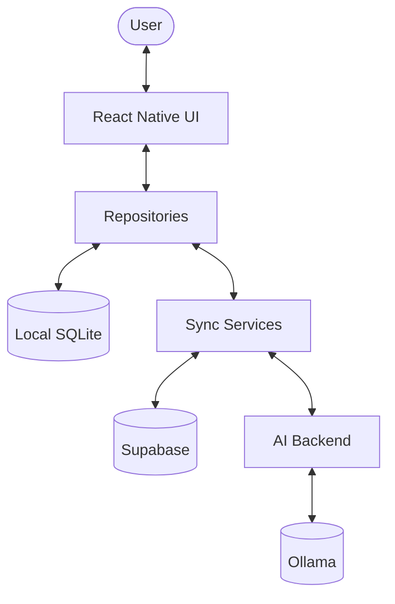

# Project Architecture

AIRagMessenger is designed as an **offline-first** mobile application. This means the application remains fully functional without a network connection, using a local database as the primary source of truth, and synchronizing with a remote backend whenever possible.

## High-Level Overview

The system consists of three main components:
1. **Mobile App (Frontend):** Built with Expo React Native.
2. **Supabase (Remote Persistence):** Handles data synchronization, user directory, and real-time messaging.
3. **AI Backend:** A local Express server that interfaces with Ollama for AI-powered features like summarization.

## Data Flow & Offline-First Model

### 1. Local-First Interaction
Every user action (sending a message, adding a contact) is first written to the local **SQLite** database via specialized **Repositories**. The UI listens to SQLite changes to ensure immediate feedback (Zero-latency UI).

### 2. Background Synchronization
The `SyncBootstrapper` manages background tasks that:
- **Push:** Send unsynced local records to Supabase.
- **Pull:** Fetch new messages and conversations from Supabase and merge them into SQLite.
- **Real-time:** Listen for incoming messages via Supabase Realtime and persist them locally.

### 3. Identity and Security
- **Clerk** manages user authentication.
- A **JWT Template** in Clerk provides a Supabase-compatible token.
- **Row Level Security (RLS)** in Supabase ensures users can only access their own conversations and messages based on their Clerk ID.

## Component Responsibilities

- **SQLite:** Source of truth for the UI.
- **Repositories:** Isolate SQL logic from the rest of the application.
- **Sync Services:** Handle the complexity of diffing local and remote state.
- **Clerk:** Handles Auth and provides the user's identity.
- **Supabase:** Acts as the "cloud" backup and real-time relay.
- **AI Backend:** Offloads heavy LLM tasks from the mobile device to a local or remote server.
