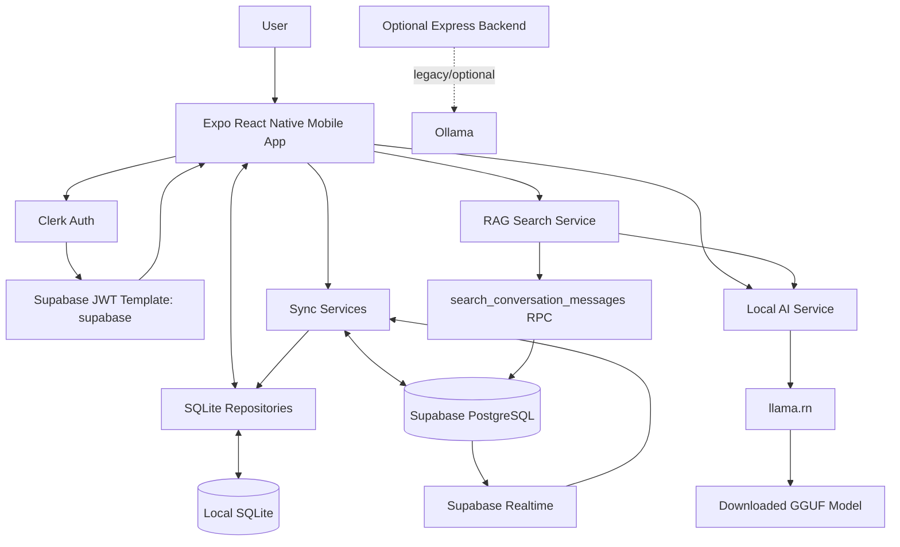
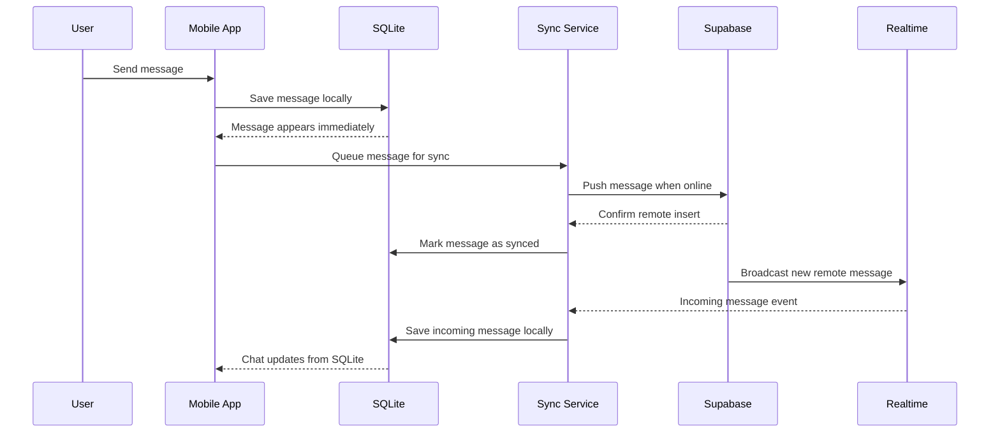
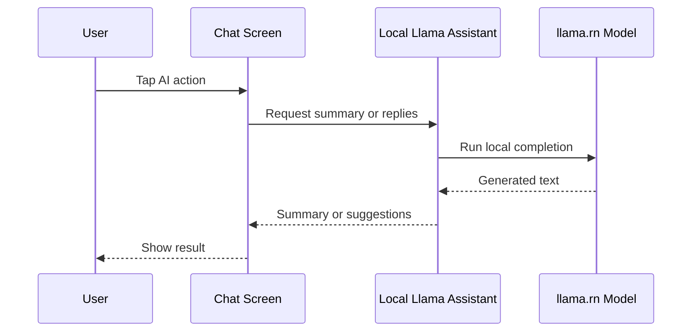
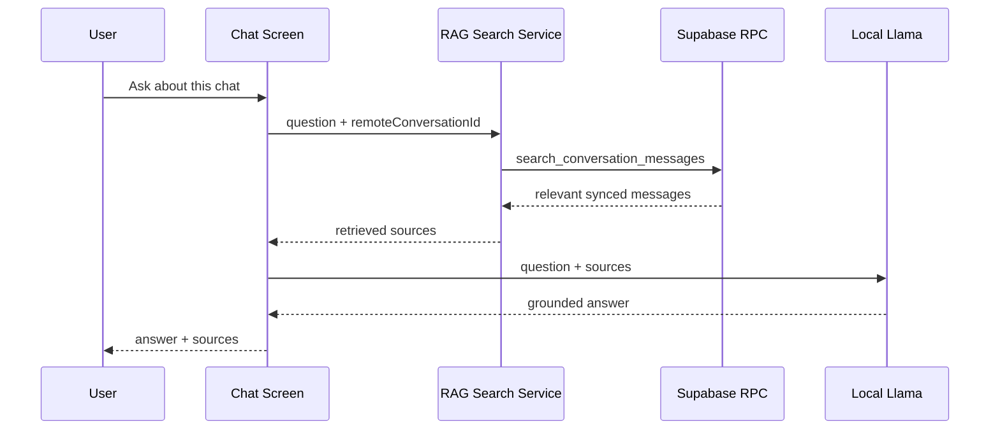

# System Design Architecture

AIRagMessenger is an offline-first mobile chat application. The mobile app treats local SQLite as the UI source of truth, synchronizes with Supabase when the network is available, and runs the current AI features on-device through `llama.rn`.

The `backend/` Express service is not part of the main mobile runtime path right now. It remains an optional standalone Ollama service for legacy/server-side AI experiments.

## Current Runtime Components

1. **Mobile App:** Expo React Native app with React Navigation, Clerk auth, SQLite repositories, sync services, and local AI screens.
2. **Local SQLite:** Primary local store for conversations, contacts, messages, sync state, and offline access.
3. **Clerk:** Authentication provider and source of the Supabase-compatible JWT template named `supabase`.
4. **Supabase:** Remote PostgreSQL persistence, row-level security, realtime message delivery, user directory lookup, and RAG message search RPC.
5. **On-device Llama:** `llama.rn` loads a downloaded GGUF model from app document storage for summaries, reply suggestions, and RAG answer generation.
6. **Optional Express Backend:** Standalone Ollama bridge under `backend/`; currently not called by the mobile app.

## High-Level System

## Offline-First Data Flow

### 1. Local Writes

When a user sends a message or creates local chat data, the app writes to SQLite first through repository modules such as `messageRepository`, `conversationRepository`, and `contactsRepository`.

This gives the UI immediate feedback even when the device is offline. Messages can carry sync state such as pending, sent, or failed.

### 2. Background Push

Sync services look for unsynced local records and push them to Supabase using the authenticated Supabase client. Clerk provides the `supabase` JWT, and Supabase RLS verifies that the current Clerk user can write the requested conversation or message.

### 3. Background Pull

The app periodically and opportunistically pulls remote conversations and messages from Supabase, then merges them into local SQLite. Opening a chat loads locally first, then remote sync runs in the background.

### 4. Realtime Updates

Active chats subscribe to Supabase Realtime inserts for the current remote conversation. Incoming remote messages are saved into SQLite, and the chat reloads from local storage.

## AI Architecture

The main app now uses on-device AI by default.

### Local AI Model Management

The Local AI settings screen downloads `Llama-3.2-1B-Instruct-Q4_K_M.gguf` into app document storage. The app can check whether the model exists, display progress, delete the model, and run a local test completion.

Because this depends on native `llama.rn`, the app should run as a native/dev-client build rather than Expo Go.

## RAG Architecture

"Ask about this chat" uses a hybrid flow:

1. The user asks a question inside a specific conversation.
2. The app retrieves the conversation's `remoteId`.
3. `searchConversationMessages` calls the Supabase RPC `search_conversation_messages`.
4. Supabase full-text search returns relevant synced messages for that conversation.
5. The app sends the question and retrieved sources to the on-device Llama model.
6. The answer is shown with source messages.

Important limitation: RAG currently searches synced Supabase messages only. Local messages that have not synced yet are visible in the chat UI but are not available to the remote search RPC.

## Security Model

- Clerk authenticates users in the mobile app.
- The app requests Clerk tokens using the `supabase` JWT template.
- Supabase Row Level Security limits access to conversations and messages where the Clerk user is a participant.
- RAG search is scoped by conversation remote ID and protected by the same authenticated Supabase access path.
- The local GGUF model file stays in app document storage on the device.

## Optional Backend Boundary

The `backend/` folder contains an Express service with Ollama-backed endpoints:

- `GET /health`
- `GET /health/ollama`
- `POST /ai/summarize`
- `POST /ai/suggest-reply`

This service type-checks independently, but the mobile app currently has no backend URL configuration and no HTTP calls into these routes. Treat it as optional/legacy unless the app is intentionally rewired to use server-side AI.

## Component Responsibilities

| Component | Responsibility |
| --- | --- |
| React Native app | UI, navigation, chat workflows, and AI modals |
| SQLite | Local source of truth for messages, contacts, conversations, and sync state |
| Repositories | Encapsulate local database reads and writes |
| Sync services | Push local changes, pull remote changes, and handle realtime updates |
| Clerk | Auth, session management, and Supabase JWT generation |
| Supabase | Remote persistence, RLS, realtime, user directory, and message search RPC |
| `llama.rn` | Runs the local Llama model on-device |
| Local AI model service | Downloads, checks, loads, releases, and deletes the GGUF model |
| RAG search service | Calls Supabase full-text search RPC for relevant conversation messages |
| Optional backend | Legacy/optional Ollama bridge; not wired into the main app |

In short, the main product architecture is **mobile app + SQLite + Supabase + local Llama**. The backend is currently separate and optional.
